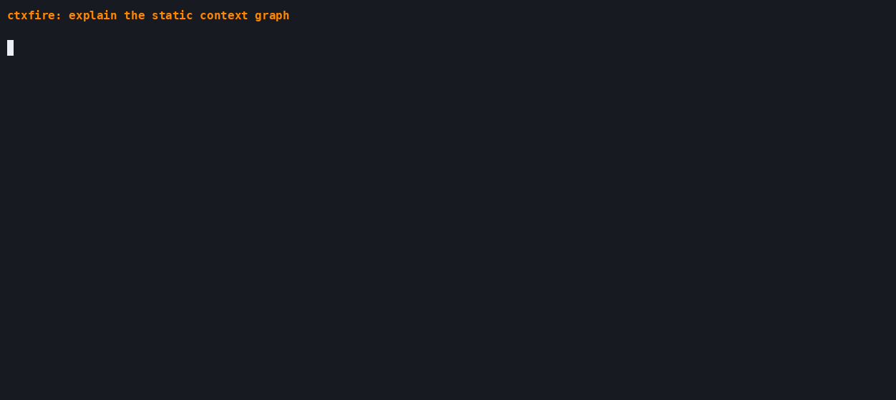

# Deterministic before/after demo

The synthetic [`../examples/demo`](../examples/demo) project has one always-on
instruction, one conditional release skill, and—in the baseline—one legacy
handbook explicitly loaded on every fire.



The checked-in [`ctxfire-demo.cast`](assets/ctxfire-demo.cast) is a 16-second
asciicast v2 recording. The rendered GIF is 16.2 seconds at 1252x560 pixels.
Both show real `ctxfire explain`, `scan`, and `diff` output with fixed event
timing; neither contains a host path, captured shell environment, or repository
contents.

```bash
ctxfire scan --config examples/demo/before.toml --format json --output before.json
ctxfire scan --config examples/demo/after.toml --format json --output after.json
ctxfire diff before.json after.json
```

Expected result:

```text
ctxfire diff
Estimated token deltas use each snapshot's recorded assumptions.

implementer: -1104 estimated tokens/day
  - docs/legacy-handbook.md
```

The number is not a measured saving. It is the reproducible difference between
two static graphs under the same recorded byte/token, activation, and schedule
assumptions. The example root is a subdirectory of this Git repository, so the
scanner deliberately reports its conservative filesystem fallback.

## Regenerate the recording

Install `agg`, make the development environment available, then run:

```bash
.venv/bin/python scripts/render_terminal_demo.py --ctxfire .venv/bin/ctxfire
```

The generator runs the real commands in temporary storage, requires the
expected `-1104 estimated tokens/day` delta, writes a fixed-timing asciicast,
checks it for the repository/home paths and common secret patterns, and renders
`docs/assets/ctxfire-demo.gif`. Use `--skip-gif` when only the cast is needed.

Verify the artifacts with:

```bash
.venv/bin/python - <<'PY'
import json
from pathlib import Path

lines = Path("docs/assets/ctxfire-demo.cast").read_text().splitlines()
events = [json.loads(line) for line in lines[1:]]
assert 10 <= events[-1][0] <= 25
PY
ffprobe -v error -show_entries stream=width,height,duration \
  -of default=noprint_wrappers=1 docs/assets/ctxfire-demo.gif
```
